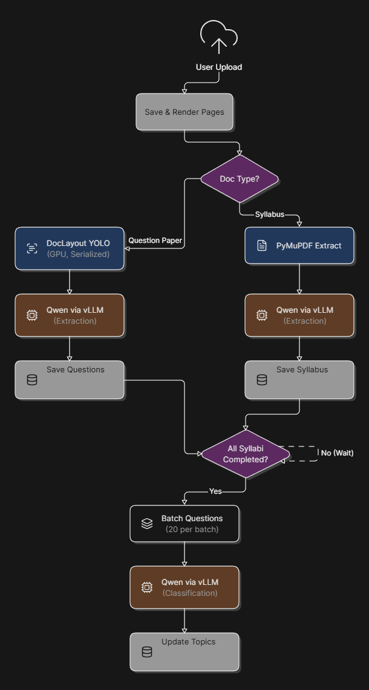

# Morae-Exam-Analysis (ExamInsight)

Data extraction and analysis pipeline for exam question papers. It extracts questions, classifies them against syllabus topics, and surfaces trend analytics.

## Pipeline

## Stack

- **Backend:** Python, FastAPI, MongoDB
- **Frontend:** React, Vite, Tailwind CSS

## Infrastructure

Built and run on a RunPod instance with an RTX 3090 GPU (24GB VRAM), used to serve the local
vLLM/Qwen model for extraction and classification.

## More details

- Backend: see [`backend/README.md`](backend/README.md)
- Frontend: see [`frontend/README.md`](frontend/README.md)
