# Question → Topic Analysis Pipeline

A data-flow overview of how an uploaded PDF becomes a set of questions with
topics/subtopics attached — every stage it passes through, where it's
stored at each point, what it depends on (DocLayout, Qwen, vLLM), and how
multiple files/batches are processed concurrently.

For full step-by-step detail (prompts, ID schemes, every failure mode) see
[`CLASSIFICATION_PIPELINE.md`](CLASSIFICATION_PIPELINE.md) — this document
is the shorter, diagram-first version of the same pipeline.

---

## 1. Diagram

```mermaid
flowchart TD
    U["User uploads N question papers + M syllabi<br/>in one HTTP request"] --> S1["Each file: saved to disk,<br/>DB row created (status = extracting),<br/>pages rendered to PNG"]
    S1 --> T1["One background task scheduled per file<br/>-- all files start concurrently"]

    T1 --> TYPE{"Question paper<br/>or syllabus?"}

    TYPE -->|"Question paper"| DL["DocLayout YOLO<br/>detect + crop content regions per page<br/>(GPU, serialized: doclayout_gpu_concurrency = 1)"]
    DL --> HQ["Concurrent:<br/>1 header-extraction call<br/>+ N question-batch calls (5 boxes each)"]
    HQ --> QWEN1[("Qwen model via vLLM<br/>qwen_max_concurrency = 8<br/>(shared globally, see below)")]
    QWEN1 --> ASM["Assemble questions + bbox + metadata"]
    ASM --> SAVEQ["Crop each question's image,<br/>insert_many into questions collection<br/>(topic: [])"]
    SAVEQ --> QPSTATUS["question_papers.status = classifying"]

    TYPE -->|"Syllabus"| TXT["PyMuPDF: extract embedded text per page<br/>(no GPU / DocLayout involved)"]
    TXT --> QWEN2[("Qwen model via vLLM<br/>qwen_max_concurrency = 8<br/>(shared globally, see below)")]
    QWEN2 --> SAVES["syllabi.status = completed<br/>extracted_data saved"]

    QPSTATUS --> GATE{"All syllabi in this<br/>project completed?"}
    SAVES --> GATE

    GATE -->|"No"| WAIT["question paper stays<br/>classifying"]
    GATE -->|"Yes"| CLAIM["Atomically claim the question paper<br/>(classification_claimed_at)"]
    CLAIM --> PRE["Preprocess: assign short temp IDs<br/>to topics / subtopics / questions"]
    PRE --> BATCH["Split questions into batches<br/>(classification_batch_size = 20)"]
    BATCH --> QWEN3[("Qwen model via vLLM<br/>qwen_max_concurrency = 8<br/>(shared globally, see below)")]
    QWEN3 --> POST["Postprocess: resolve temp IDs back<br/>to real topic/subtopic names"]
    POST --> WRITE["bulk_write topic field<br/>onto matching questions"]
    WRITE --> DONE["question_papers.status = completed"]
```

The three "Qwen model via vLLM" boxes are drawn separately for readability,
but they are **the same client and the same 8-slot concurrency limit** —
header extraction, question extraction, syllabus extraction, and
classification all funnel through one shared semaphore. See
[section 4](#4-concurrency--batching).

---

## 2. Stage-by-stage: what happens and where data lands

| # | Stage | What happens | Model / GPU dependency | Where it's stored |
|---|---|---|---|---|
| 0 | **Upload** | File saved to disk; DB row created (`status: "extracting"`); PDF pages rendered to PNG | — | Disk: `uploads/{project_id}/{uuid}_{filename}` (original), `uploads/{project_id}/pages/{doc_id}/{n}.png` (rendered pages). Mongo: new row in `question_papers` or `syllabi` |
| 1a | **Question paper — box detection** | DocLayout YOLO detects every content region per page, crops it, orders all boxes in whole-document reading order | DocLayout YOLO model (local GPU) | In memory only (`BoxRecord` list) |
| 1b | **Question paper — header extraction** | First 20 boxes grouped into ~5 composite images, sent as **one** call | Qwen via vLLM | In memory (`ExamHeaders`) |
| 1c | **Question paper — question extraction** | Every box chunked into batches of 5; each batch is its own call, classifying every image and extracting question text/marks/bbox | Qwen via vLLM (batches run concurrently) | In memory (`content[]`) |
| 1d | **Question paper — save** | Bounding boxes expanded; each question's image cropped from its rendered page; all questions inserted in one `insert_many` | — | Mongo: one row per question in `questions` (`topic: []`, `cropped_image`, `bbox`, ...). Mongo: `question_papers.extracted_data` gets the full result; `status → "classifying"` |
| 2a | **Syllabus — text extraction** | Embedded PDF text pulled per page (no OCR, no images) | PyMuPDF only — no GPU | In memory |
| 2b | **Syllabus — extraction call** | Whole document's text sent as **one** call | Qwen via vLLM | In memory (`SyllabusExtraction`) |
| 2c | **Syllabus — save** | Result saved directly | — | Mongo: `syllabi.extracted_data`; `status → "completed"` |
| 3 | **Classification gate** | After *every* extraction event, checks whether all syllabi in the project are `"completed"` | — | Reads `syllabi.status` across the project |
| 4 | **Claim** | If ready, atomically claims the question paper so it's classified exactly once | — | Mongo: `question_papers.classification_claimed_at` set |
| 5 | **Preprocess** | Every completed syllabus's topics/subtopics get short temp IDs (`"1"`, `"1-1"`, ...); every question in this paper gets a short temp ID (`"1"`, `"2"`, ...); questions split into batches of 20 | — | In memory only — temp IDs never touch the DB |
| 6 | **Classify** | Each batch (full topic list + its slice of questions) sent as its own call, batches run concurrently | Qwen via vLLM | In memory (raw ID-based response) |
| 7 | **Postprocess** | Temp IDs resolved back to real subject/topic/subtopic names; hallucinated IDs dropped and logged | — | In memory (`{subject_name, topic, subtopics}[]`) |
| 8 | **Save results** | One `bulk_write` updates the `topic` field on every question that got a non-empty result | — | Mongo: `questions.topic` updated. `question_papers.status → "completed"` (always, win or lose) |

---

## 3. Dependencies

| Component | Used for | Runs where |
|---|---|---|
| **PyMuPDF (`fitz`)** | Rendering PDF pages to PNG at upload time (both doc types); rasterizing pages for DocLayout (question papers); extracting embedded text (syllabi) | CPU, in-process |
| **DocLayout YOLO** (`doclayout-yolo-slim`) | Detecting and cropping content regions on question paper pages. **Not used for syllabi at all** — syllabus extraction is pure text. | Local GPU. One model instance, loaded once, shared across the whole app, serialized to 1 concurrent inference (`doclayout_gpu_concurrency`) since it shares the GPU with vLLM and isn't thread-safe |
| **Qwen** (served as `model` in vLLM) | The actual LLM behind all four call sites: header extraction, question extraction, syllabus extraction, classification | Local GPU, via vLLM's OpenAI-compatible endpoint (`vllm_base_url`) |
| **vLLM** | Hosts Qwen, serves the structured-output (guided JSON) endpoint every call above is constrained against | Must be running and reachable *before* any upload — if it's down, every extraction/classification call fails immediately |

Every Qwen call — regardless of which of the four stages it's for — goes
through one function: `call_structured()` in
`app/local_extraction_service/qwen_client.py`. That's the single choke
point for the whole pipeline's model usage.

---

## 4. Concurrency & batching

**Multiple files, one upload:** `POST /projects/{project_id}/documents`
accepts any number of question papers and syllabi in one request. Every
file gets its own DB row and its own independent background task,
scheduled immediately — from the app's point of view, all uploaded files
"start" processing at the same time. Real parallelism past that point is
governed entirely by the two limits below, not by how they were uploaded.

**DocLayout — hard serialization (question papers only):**
`doclayout_gpu_concurrency = 1` means only **one** PDF's box-detection
runs at a time, app-wide. If 5 question papers are uploaded together,
their DocLayout passes queue up and run one after another — syllabi are
unaffected since they never touch DocLayout.

**Qwen/vLLM — one shared concurrency ceiling for everything:**
`qwen_max_concurrency = 8` is a single semaphore shared by *every* Qwen
call in the app: header extraction, question-batch extraction, syllabus
extraction, and classification, across every document being processed at
once. At most 8 requests are ever in flight against vLLM simultaneously —
everything else queues behind them, regardless of which stage or which
document they belong to.

**Batching within one document:**

| Stage | Batch size setting | Default | Batches run... |
|---|---|---|---|
| Question extraction (one question paper) | `question_batch_size` | 5 boxes/call | concurrently (`asyncio.gather`), each independently fault-tolerant |
| Header extraction (one question paper) | `header_boxes_per_image` / `header_bbox_limit` | 4 boxes/image, 20 boxes total | one single call (not batched further) |
| Classification (one question paper) | `classification_batch_size` | 20 questions/call | concurrently (`asyncio.gather`); the **full project syllabus is resent on every batch**, only the question slice changes |
| Syllabus extraction | — | whole document, one call | n/a — never batched |

**Net effect:** uploading many files at once, or having a question paper
with hundreds of questions, is always safe — nothing blocks or crashes on
volume. But throughput is capped by 8 concurrent Qwen requests and 1
concurrent DocLayout inference, shared across the *entire app*, not per
document. More simultaneous uploads means more queueing, not more parallel
GPU work — worth knowing before reading too much into per-document timeouts
under heavy concurrent load.

---

## 5. Where everything ends up (final state)

| Data | Location |
|---|---|
| Original uploaded PDF | Disk: `uploads/{project_id}/{uuid}_{filename}` |
| Rendered page images | Disk: `uploads/{project_id}/pages/{doc_id}/{page_index}.png` |
| Syllabus topics/subtopics | Mongo `syllabi.extracted_data.content[]` — `{topic, subtopics[], weightage, hours}` |
| Question paper header metadata | Mongo `question_papers.extracted_data` — `{degree, subject_name, subject_code, exam_date, semester, total_marks}` |
| Individual questions | Mongo `questions` collection — one row per question, with `cropped_image` (base64 PNG) and `bbox` |
| Final topic/subtopic mapping | Mongo `questions.topic[]` — `[{subject_name, topic, subtopics[]}]`, written only by classification, empty until then |
